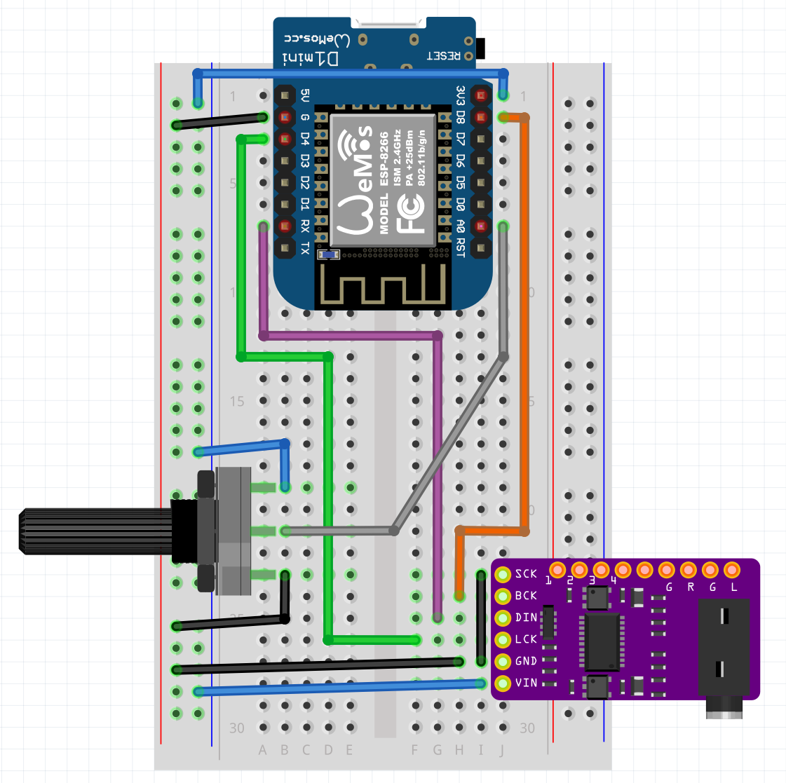

# ESP8266 experiment with the Mozzi Library

This code implements a very simple event sequencer and "instruments" to test the [Mozzi library](https://github.com/sensorium/Mozzi) with a I2S DAC, and also play with stereo and polyphony.

## Notes 

- Beware of using speakers or headphones when testing new things, it's very easy to make very loud/harsh/high pitch sounds, especially if amplified: I used a small pc speaker for this.
- Also ensure your hardware connections are correct to avoid damaging any equipment.
- You may need to add a capacitor to reduce noise when using PWM.

## Context

I used a WeMos D1 mini board with sound output on a PCM5102 I2S DAC (note: I2S != I2C).

PWM modes also work (using either D4 or RX) with relevant code changes to the `MOZZI_AUDIO_MODE` define.

## Using 

- Install Platformio
- Import the project
- Build & Upload

If using official Mozzi and not my fork ensure that the [patch to remove old imports](https://github.com/ncravino/Mozzi/commit/d80a4e5d7c8850a7434879542b8c74506dce922e) has been applied.

## Parts

- 1 esp8266 board with the relevant pins accessible, I used a WeMos D1 Mini
- 1 PCM5102 I2S DAC, but should work with any I2S DAC
- 1 potentiometer, e.g. 10k ohms

## Wiring

| WeMos D1 Mini (ESP8266) | PCM5102 Board |
| --- | ---| 
| ESP8266 GPIO15 (WeMos D8) | BCK or BCLK |
| ESP8266 GPIO03 (WeMos RX) | DIN |
| ESP8266 GPIO02 (WeMos D4) | LRCK or LCK |
| 3.3V | VIN |
| G | GND | 
| G | SCK | 

Leave unconnected any other pins on the PCM5102 board.
 
| WeMos D1 Mini (ESP8266) | Potentiometer |
| --- | ---| 
| ESP8266 ADC0 (WeMos A0) | OUTPUT |
| 3.3V | VCC |
| G | GND | 

## Licenses

### Code:
- AGPL 3.0 or later, see [License](./LICENSE)

### Everything Else:
- Creative Commons Attribution-NonCommercial-ShareAlike 4.0 International, see [CC BY-NC-SA](https://creativecommons.org/licenses/by-nc-sa/4.0/)

## Helpful Resources Used

- [Artium Nihamkin - PCM audio on esp8266 using the PCM5102 chip](http://www.nihamkin.com/pcm-audio-on-esp8266-using-the-pcm5102-chip.html)
- [Last Minute Engineers - WeMos D1 Pin Out Reference](https://lastminuteengineers.com/wemos-d1-mini-pinout-reference/)
- [todbot - Mozzi Experiments](https://github.com/todbot/mozzi_experiments)
- [Mozzi Documentation](https://sensorium.github.io/Mozzi/doc/html/hardware_esp8266.html)
